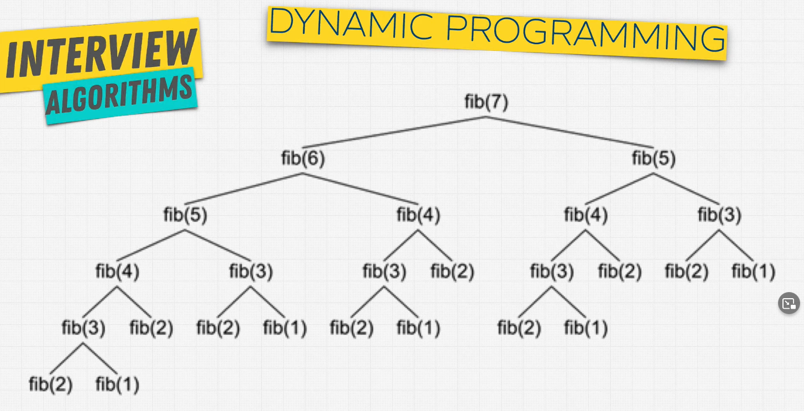
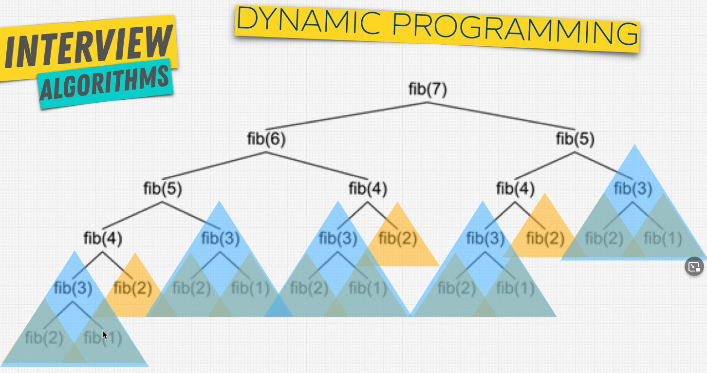
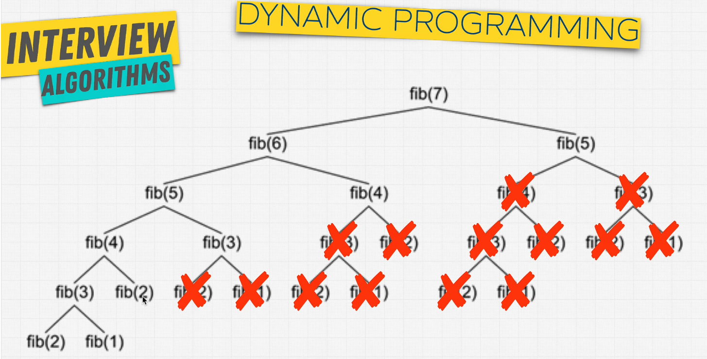
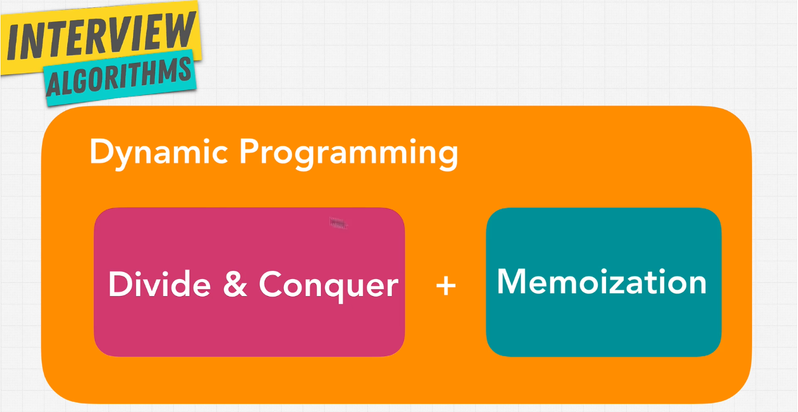

# Dynamic Programming

What is it? It is an **optimization technique**.

Do you have something you can cache? Use **Dynamic Programming**

## Memoization - Caching

Caching - store values for use later on. Think of it like a backpack to hold items that you need. It can really be useful in situations where the same value is being calculated the same over and over again. See picture below:

These calculations are repetitive, adding more calls to the stack.

Memoization helps us avoid these repetitive calculations and simply return the result since it's already been calculated.

### When to use Dynamic Programming

1. Can be divided into subproblem
2. Recursive Solution
3. Are there repetitive subprobelms?
4. Memoize subproblems
5. Demand a raise from your boss. (LOL)
