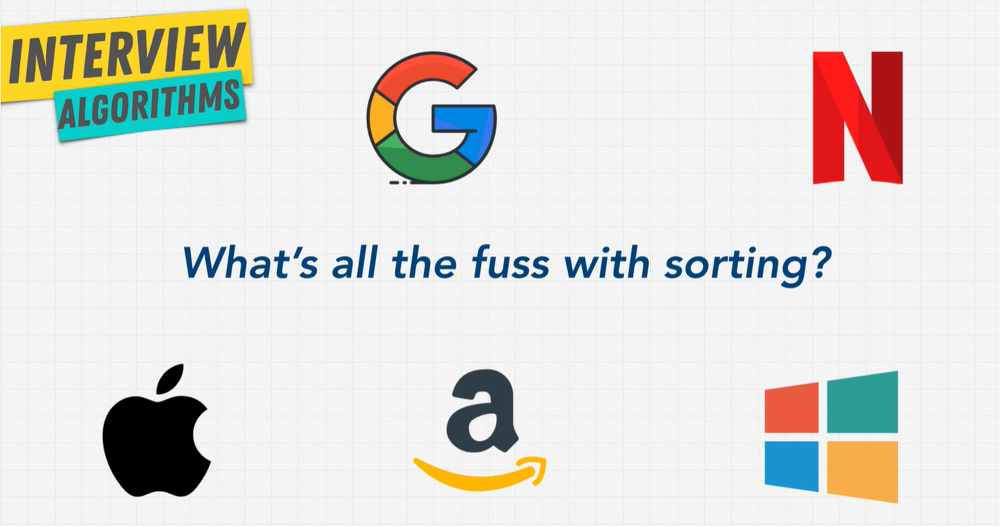

# Algorithms

Algorithms are functions that programmers write. They are steps in a process that we take to perform a desired action with computers. Algorithms allow us to use language built-in data structures, like arrays, objects or primitives like integers, booleans and custom data types.

Algorithms allow us to perform actions on that data.

> Data Structures + Algorithms = Programs

## Algorithms

- Sorting
- Dynamic Programming
- BFS + DFS (Searching)
- Recursion

# Recursion

Recursion is not really an algorithm, but a concept. Recursion is a function that calls itself inside of its function.

## Stack Overflow

When a recursive function is infinitely called, causing the function call stack to overflow. This would eat up our memory if it didn't stop.

How do we stop it? _Answer: we need a base case._

```js
function inception() {
  inception();
}

inception(); // calling this would cause a Stack Overflow
```

## Anatomy of Recursion

3 Rules:

1. Identify the base case
2. Idetify the recursive case
3. Get closer and closer and return when needed

```js
let counter = 0;

function inception() {
  // base case
  if (counter > 3) {
    return "done";
  }
  counter++;
  return inception();
}
```

### Pros and Cons of Recursion

| Pros        | Cons        |
| ----------- | ----------- |
| DRY         | Large Stack |
| Readability | ---         |

### When to use recursion

**New rule:**

Every time you are using a tree or converting something into a tree, consider recursion.

1. Divided into a number of subproblems that are smaller instances of the same problem.
2. Each instance of the subproblem is identical in nature
3. The solutions of each subproblem can be combined to solve the problem at hand.

**Divide and Conquer using Recursion**

_Recursion can make tasks really easy since it's breaking down a big problem into a subproblem of its own, and makes the code easier in terms of readability and coding_

Anything you can do with recursion CAN be done iteratively (loop)

# Sorting

Why do we care about sorting? It's important when inputs become exponentially large.

These companies care **a lot** about sorting. They usually have a custom sorting algorithm for their specific needs.


Most common types of sorts:

- Bubble Sort (highly inefficient, usually meant for teaching) \*
- Insertion Sort \*
- Selection Sort \*
- Merge Sort
- Quick Sort

\* elementary sorts

## The Issue with .sort()

```js
const letters = ["a", "d", "z", "e", "r", "b"];
const basket = [2, 65, 34, 2, 1, 7, 8];

console.log(letters.sort()); // ["a", "b", "d", "e", "r", "z"]
console.log(basket.sort()); // [1, 2, 2, 34, 65, 7, 8] -  wait, what's going on here?
```

Time and space complexity of the sort cannot be guaranteed as it depends on the implementation. (MDN Web Docs)

[Sorting Algorithms Visualization](https://www.toptal.com/developers/sorting-algorithms)

[Youtube - Dancing Algorithms](https://www.youtube.com/user/AlgoRythmics/videos)