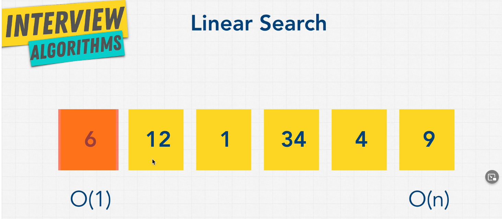
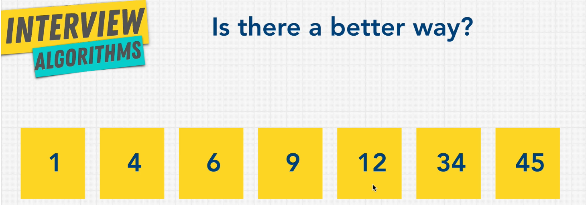
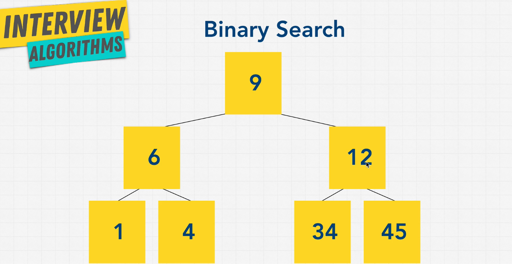

# Searching & Traversal

- Linear Search
- Binary Search
- Depth First Search (DFS)
- Breadth First Search (BFS)



It goes through the array items one by one until a match is found. Best case is the item is at the beginning O(1). Worst case is O(n)



Short answer: **YES**

We can use binary search by going down the middle of the array. Each operation discards half of the array if the number isn't found. Very similar to BST.

## Graph + Tree Traversal



Graphs and trees use both Breadth First Search, and Depth First Search

### Breadth First Search

Left to Right, level by level. Uses additional memory to track the nodes and its children.

```js
// Breadth First Search

//       9
//    6     12
//  1  4  34  45
BFS[(9, 6, 12, 1, 4, 34, 45)];
```

### Depth First Search

Follows one branch of the tree and goes deep. If no match is found, then it will go back to its ancestor to see if there's any unexplored nodes. It goes left first, then right.

```js
// Depth First Search

//       9
//    6     12
//  1  4  34  45
DFS[(9, 6, 1, 4, 12, 34, 45)];
```

### Pros and Cons of BFS/DFS

[Stack Overflow: Time and Space Complexity of BFS and DFS Traversal](https://stackoverflow.com/questions/9844193/what-is-the-time-and-space-complexity-of-a-breadth-first-and-depth-first-tree-tr)

_Copied from StackOverflow:_

**_BFS_**:

Time complexity is `O(|V|)`, where `|V|` is the number of nodes. You need to traverse all nodes.
Space complexity is `O(|V|)` as well - since at worst case you need to hold all vertices in the queue.

**_DFS_**:

Time complexity is again `O(|V|)`, you need to traverse all nodes.
Space complexity - depends on the implementation, a recursive implementation can have a `O(h)` space complexity [worst case], where `h` is the maximal depth of your tree.
Using an iterative solution with a stack is actually the same as BFS, just using a stack instead of a queue - so you get both `O(|V|)` time and space complexity.

(\*) Note that the space complexity and time complexity is a bit different for a tree than for a general graphs becase you do not need to maintain a `visited` set for a tree, and `|E| = O(|V|)`, so the `|E|` factor is actually redundant.

| Type of Search | Pros                         | Cons        |
| -------------- | ---------------------------- | ----------- |
| BFS            | Shortest Path/Closer Nodes   | More Memory |
| DFS            | Less Memory/Does path exist? | Can be slow |

### When to Use BFS or DFS?

If you know a solution is not far from the root of the tree:

- BFS

If the tree is very deep and the solutions are rare:

- BFS (DFS will take long)

If the tree is very wide:

- DFS (BFS will need too much memory)

If solutions are frequent but located deep in the tree:

- DFS

Determining whether a path exists between two nodes:

- DFS

Finding the shortest path:

- BFS
