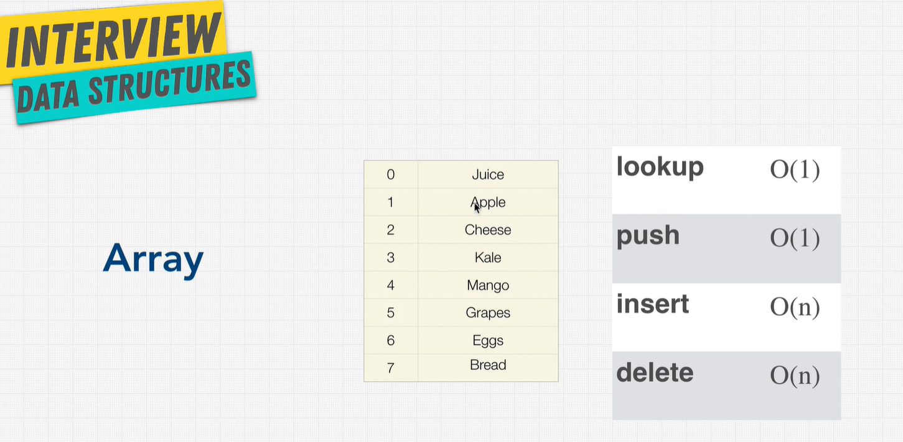

# Arrays

Arrays organize items sequentially.



| Method | Big O |
| ------ | ----- |
| lookup | O(1)  |
| push   | O(1)  |
| insert | O(n)  |
| delete | O(n)  |

## Dynamic vs Static Arrays

Static arrays are fixed in size. For example, languages like Java need to specify the exact size

```java
// static array
int [] a = new Array[10] // size 10

// dynamic array
ArrayList<String> cars = new ArrayList<String>();
```

| Method   | Big O |
| -------- | ----- |
| lookup   | O(1)  |
| append\* | O(1)  |
| insert   | O(n)  |
| delete   | O(n)  |

\* can be O(n) - this is because once the array is filled and a new item needs to be inserted, the old array will need to be copied, and append the new item after the old array has been copied.

In JavaScript, dynamic arrays are implemented into the language.  You don't need to explicitly decalre the size.

## Pros and Cons of Arrays

| Pros   | Cons |
| -------- | ----- |
| Fast lookup   | Slow inserts |
| Fast push/pop |Slow deletes  |
| Ordered   | Fixed size\*  |
