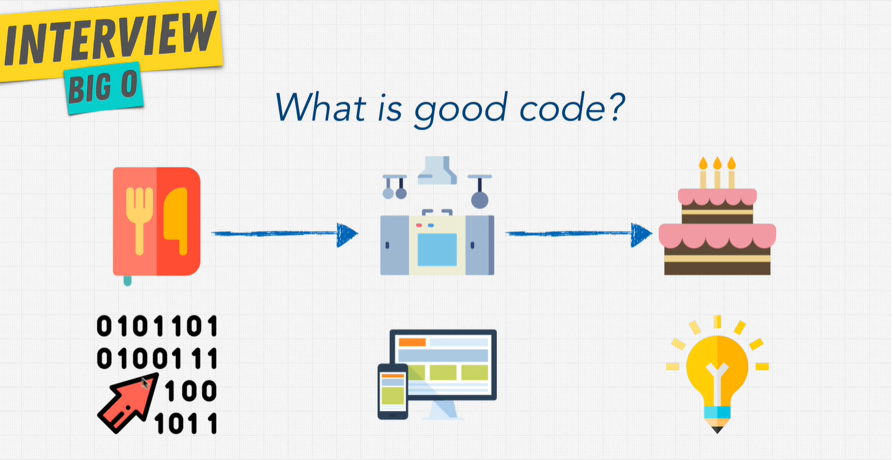
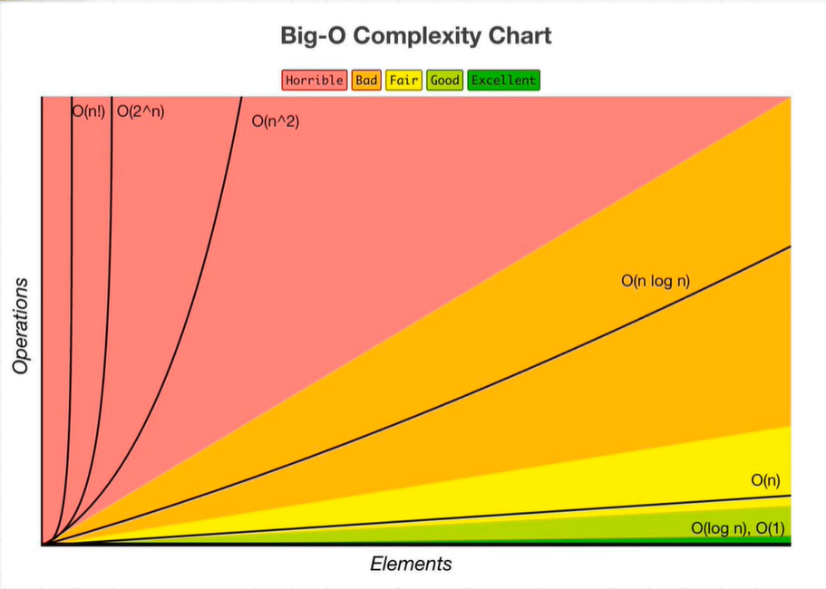

# Big O Notation

Or otherwise known as: Asymptotic Notation.

## What is good code?

It must be:

1. Readable
2. Scalable (How we can measure Big O)

## What is an Algorithm?

_Think about how we would bake a cake_


We have a recipe, and an oven, hopefully to bake a cake.
The recipe are instructions, the oven is like your computer, and hopefully you can make a program to do something (like turning on the light).

Simply put, an **algorithm** is a set of instructions to perform a task, like how a recipe contains a list of the ingredients and instructions to follow to bake or cook something.

```js
// How long does it take a certain problem through a problem
// What is the efficiency of this code?

// This is the runtime
const nemo = ["nemo"];

function findNemo(array) {
  for (let i = 0; i < array.length; i++) {
    if (array[i] === "nemo") {
      console.log("Found nemo");
    }
  }
}
```

Big O notation is the language we use for talking about how long an algorithm takes to run. Which one is better when it comes to scale?



# O(n) - Linear Runtime

```js
// What is the Big O of the function?
const nemo = ["nemo"];

function findNemo(array) {
  for (let i = 0; i < array.length; i++) {
    if (array[i] === "nemo") {
      console.log("Found nemo");
    }
  }
}
```

The Big O of this function is O(n) because, if Nemo isn't found on the first index, but on the very last one, then we can say that at its worse case scenario, is O(n) - linear time. O(n) means that as the number of inputs grow, so does the number of operations, _linearly_. 1:1

# O(1) - Constant time

```js
// What is the runtime of thie function?

function compressFirstBox(boxes) {
  console.log(boxes[0]); // This is O(1).
}
```

It's only grabbing the first item in the array. So it will always take 1 operation.

## Big O Exercise 1

```js
// What is the Big O of the below function? (Hint, you may want to go line by line)
function funChallenge(input) {
  let a = 10;
  a = 50 + 3;

  for (let i = 0; i < input.length; i++) {
    // O(n)
    anotherFunction(); // O(n)
    let stranger = true; // O(n)
    a++;
  }
  return a;
}

// answer: it's O(n)
```

## Big O Exercise 2

```js
// What is the Big O of the below function? (Hint, you may want to go line by line)
function anotherFunChallenge(input) {
  let a = 5;
  let b = 10;
  let c = 50;
  for (let i = 0; i < input; i++) {
    let x = i + 1;
    let y = i + 2;
    let z = i + 3;
  }
  for (let j = 0; j < input; j++) {
    let p = j * 2;
    let q = j * 2;
  }
  let whoAmI = "I don't know";
}

// answer: it's also O(n)
```

## Simplifying Big O

When calculating Big O, we can do the following:

- Drop the constants
- Drop the less significant terms

Example 1:

```js
function printAllItemsTwice(items) {
  items.forEach((item) => {
    console.log(item);
  });

  // Once more, with feeling
  items.forEach((item) => {
    console.log(item);
  });
}

// This is O(2n), which simplifies to O(n)
```

Example 2:

```js
function printFirstItemThenFirstHalfThenSayHi100Times(items) {
  console.log(items[0]);

  const middleIndex = Math.floor(items.length / 2);
  let index = 0;

  while (index < middleIndex) {
    console.log(items[index]);
    index++;
  }

  for (let i = 0; i < 100; i++) {
    console.log("hi");
  }
}

// This is O(1 + n/2 + 100), which is simply just O(n)
```
