# Graphs

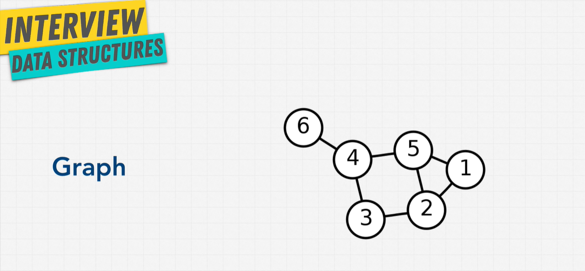
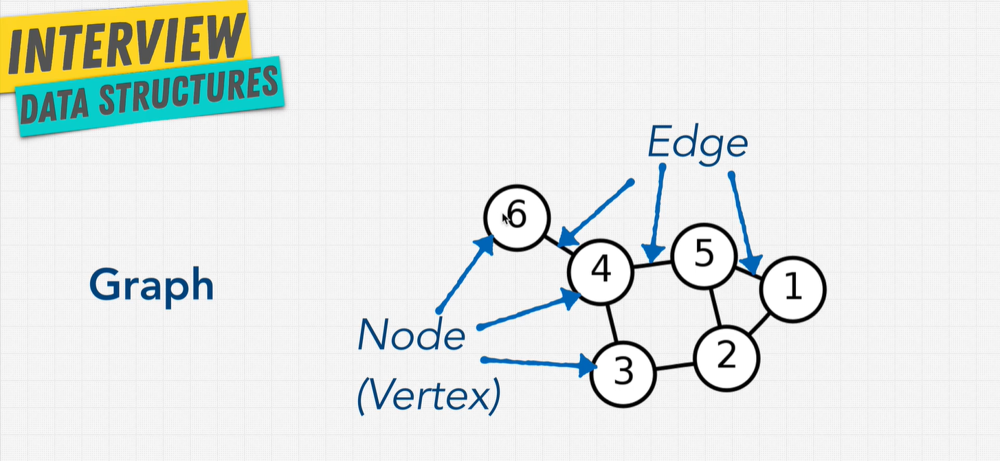

Graphs are really great to represent real-world networks. They can be used in social networks, recommendation engines, google maps, etc.

## Types of Graphs

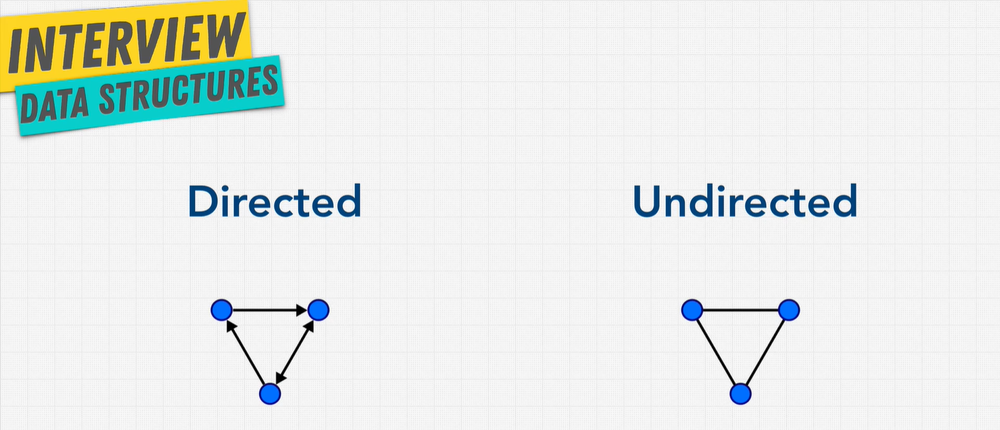

- Undirected graph: think of a two way street
- Directed graph: one way street
  - Twitter
  - Youtube Subscriptions

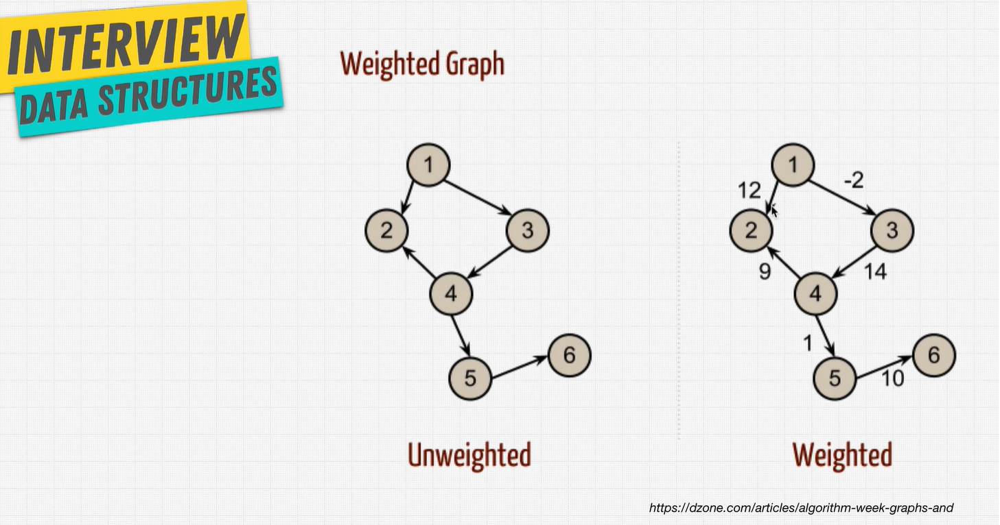
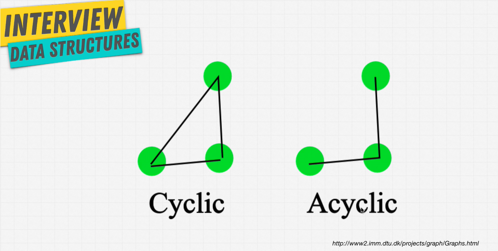

- Cyclic: when you can go from one node to another in a circle
- Acyclic: you can go from one node to another and back, but not in a circle

### Undirected unweighted cyclic graph

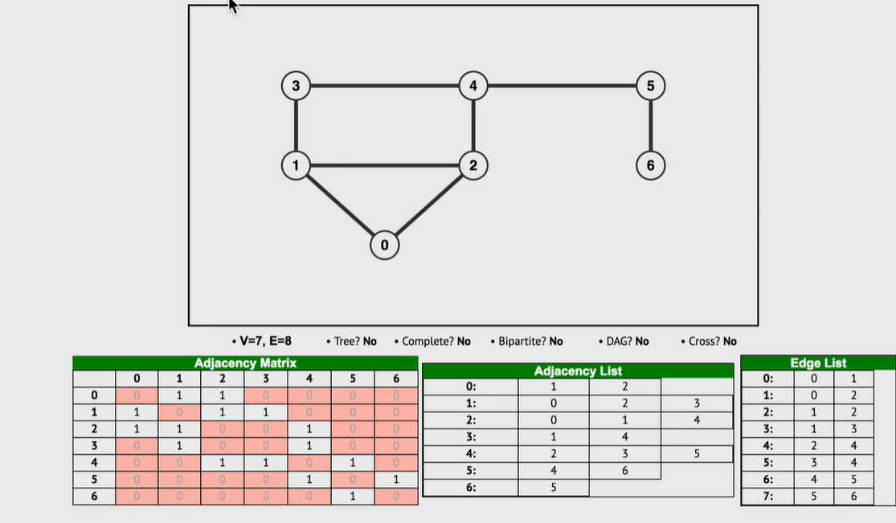

### Undirected weighted cyclic graph

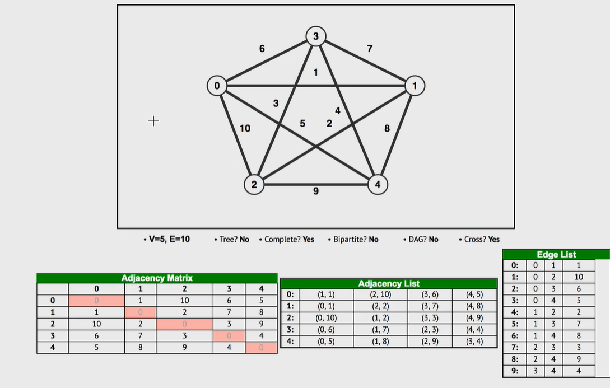

### Directed unweighted acyclic graph

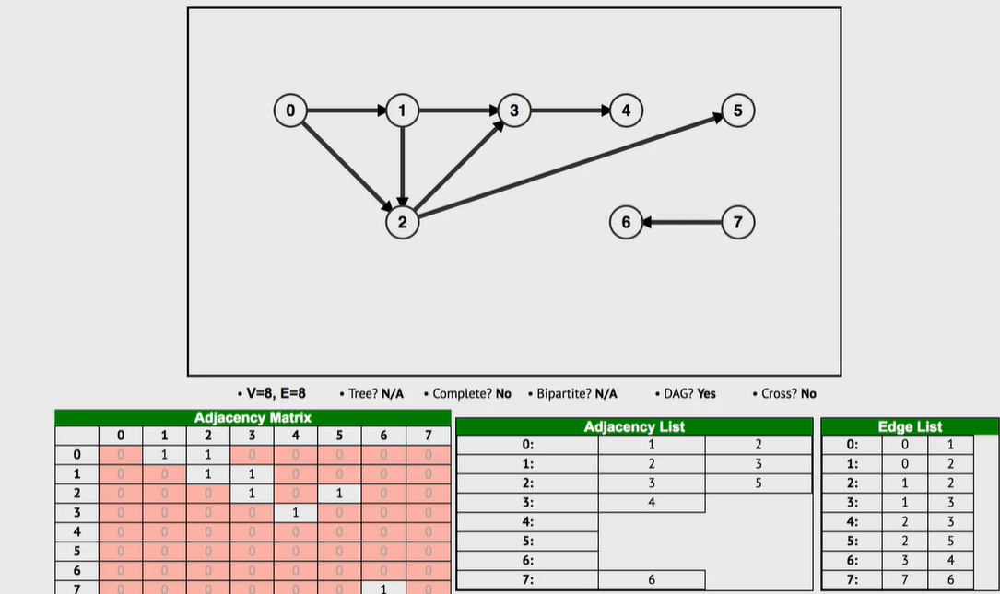

### Directed weighted acyclic graph

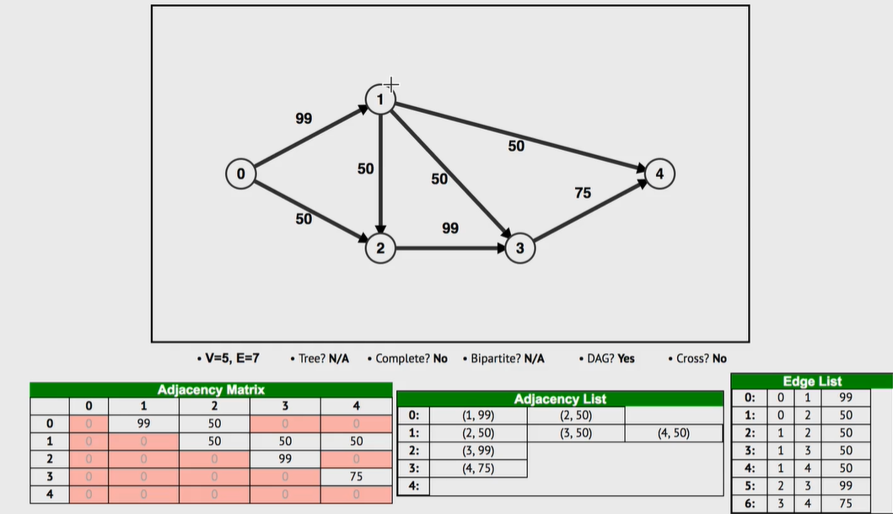

### Directed acyclic graph

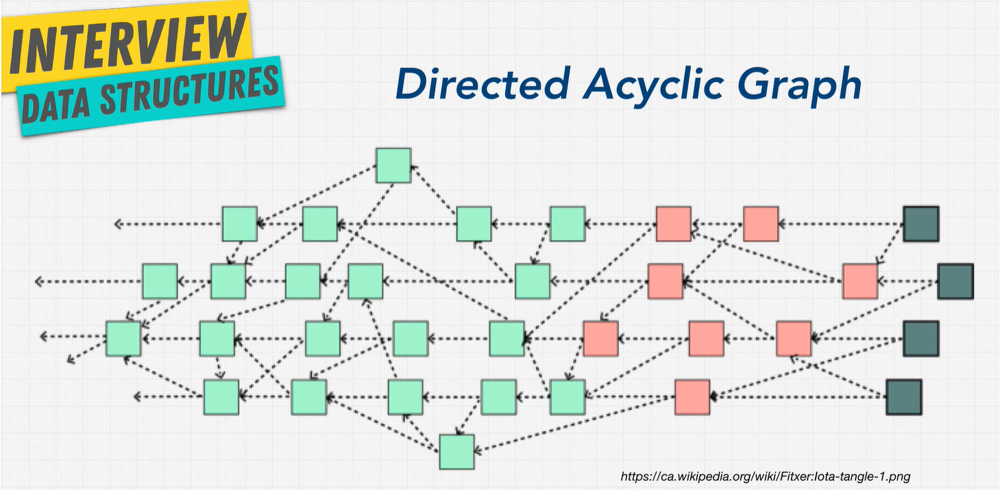

## Graph Example

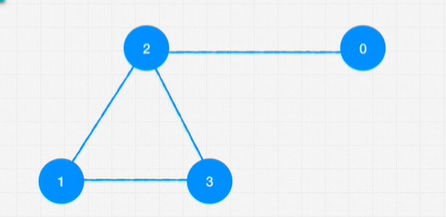

```js
// Edge list
const graph = [
  [0, 2],
  [2, 3],
  [2, 1],
  [1, 3],
];

// Adjacent List
const graph1 = [[2], [2, 3], [0, 1, 3], [1, 2]];

// Adjacent Matrix
const graph3 = [
  [0, 0, 1, 0],
  [0, 0, 1, 1],
  [1, 1, 0, 1],
  [0, 1, 1, 0],
];
```
### Pros and Cons of Graphs

Very useful when it comes to relationships.  Finding the shortest path, traversing the graph (relationships is important)

| Pros          | Cons            |
| ------------- | --------------- |
| Relationships | Scaling is hard |
