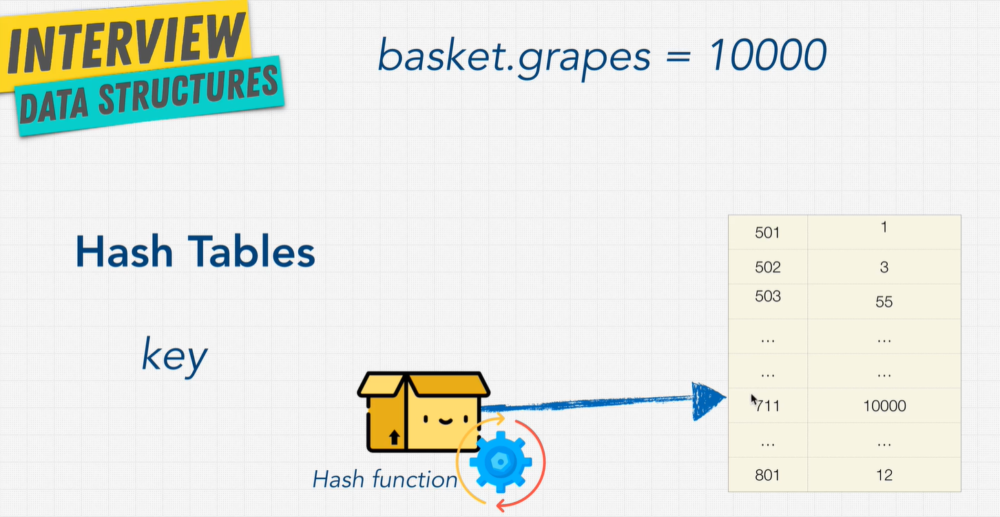
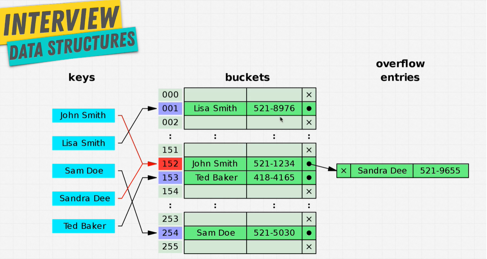

# Hash Tables

Commonly used in interview questions. Hashmaps are OP.

They store data in key:value pairs. Similar to an array, expect we don't get to decide where to put it.

| Method | Big O |
| ------ | ----- |
| insert | O(1)  |
| lookup | O(1)  |
| delete | O(1)  |
| search | O(1)  |

Collisions can cause O(n) runtime

## Hash Tables vs Arrays

Hash Tables

| Method | Big O |
| ------ | ----- |
| insert | O(1)  |
| lookup | O(1)  |
| delete | O(1)  |
| search | O(1)  |

Arrays

| Method | Big O |
| ------ | ----- |
| search | O(n)  |
| lookup | O(1)  |
| push\* | O(1)  |
| insert | O(n)  |
| delete | O(n)  |

## Pros and Cons of Hash Tables

| Pros           | Cons               |
| -------------- | ------------------ |
| Fast Lookups\* | Unordered          |
| Fast Inserts   | Slow key iteration |
| Flexible keys  |                    |

\* Good collision resolution needed
