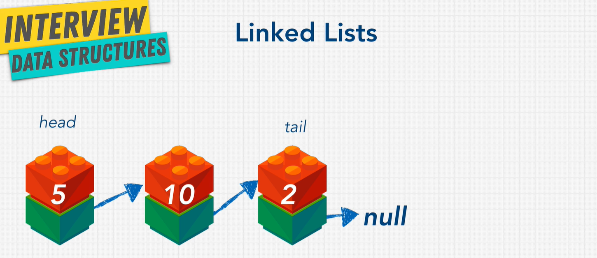

# LinkedLists



So, what are they? A singly linked list contains a list of nodes. These nodes have two elements:

- value
- \*next

A Linked List has a head (first item in the list) and a tail (the last item in the list). The tail will always point to null. They contain any data type.

```js
// pseudo code
linked list: apples -> grapes -> pears

apples
8947 -> grapes
        1002 -> pears
                1132 -> null
```

[Visualgo Linked List](https://visualgo.net/en/list)

Why might we use Linked Lists?

Linked Lists have a more loose structure. You can insert data in the middle of the list by assigning a new pointer. In arrays, you need to shift the whole data down the array (since they are indexed).

| Method  | Big O |
| ------- | ----- |
| prepend | O(1)  |
| append  | O(1)  |
| lookup  | O(n)  |
| insert  | O(n)  |
| delete  | O(n)  |

What's a pointer?  It's a reference to an object in memory.  This would be pass by reference (since it's not creating a copy).