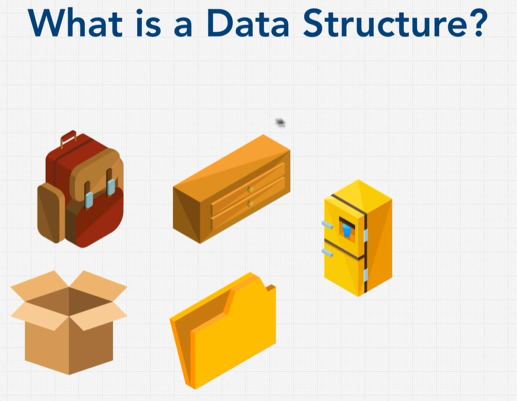
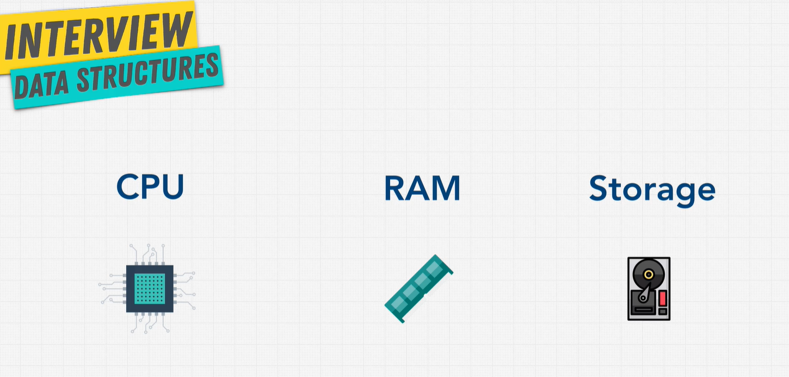
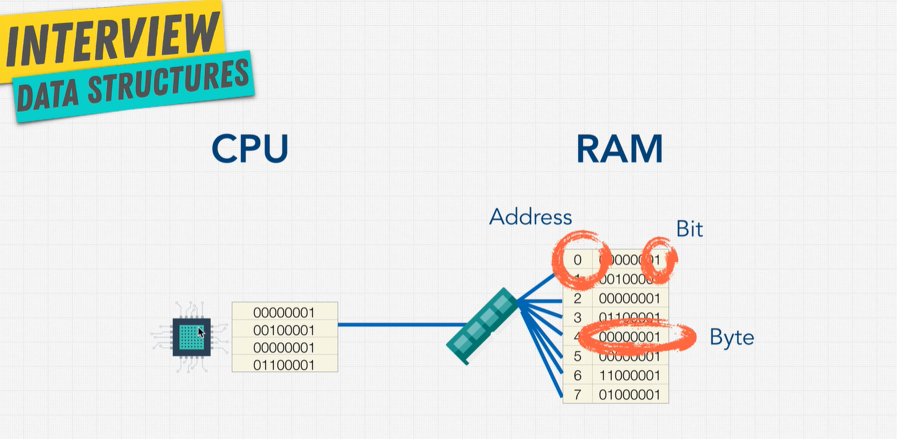

# ZTM: Mastering The Coding Interview

This git repository will contain the fundamentals of Data Structures and Algorithms which are typically taught in the first 2 years of Computer Science.  I will be using this to track my progress as well as use it as a refresher to brush up on these basics.

Feel free to use this repo if you wish by cloning it.  Also contact me if there are any mistakes here by submitting a pull request.

## Table of Contents

[Big O](./BigO)

# How To Solve Coding Problems

## So What Are Companies Looking For?

1. Analytic Skills
    - How can you think through a problem and analyzing things?
2. Coding Skills
    - Do you code well?  Is it readable?
3. Technical Skills
    - Do you know the fundamentals?  Do you understand the pros/cons of different solutions?
4. Communication Skills
    - Do you fit well with the company?  Do you communicate well your ideas and solutions?

They want to know you look for answers.

## What We Need For Coding Interviews

**Data Structures**
- Arrays
- Stacks
- Queues
- Linked Lists
- Trees
- Tries
- Graphs
- Hash Tables

**Algorithms**
- Sorting
- Dynamic Programming
- Breadth First Search + Depth First Search (Searching)
- Recursion

> Data Structures + Algorithms = Programs

## What Is A Data Structure?

Is a collection of values.  They can have relationships among them and methods that you can use.  Each of their own pros and cons, so its important to know these so you can pick the best one to use for the problem.

Like in the above diagram, each of these storage options have a very specific function.  A backpack is very convenient to carry small items and things to carry around with you.  A drawer is used to store clothes, fridge to store food, etc.

In Computer Science, we have Data Structures to store different types of data, or to organize data efficiently.

There are always tradeoffs to each data structure.

2 parts to understanding data structures:
1. How to Build One
2. How to Use it

Most of these Data Structures are prebuilt, ready for us to use.  However, most importantly, we need to understand the foundations behind them so we can pick the best one to use.

### How Computers Store Data

