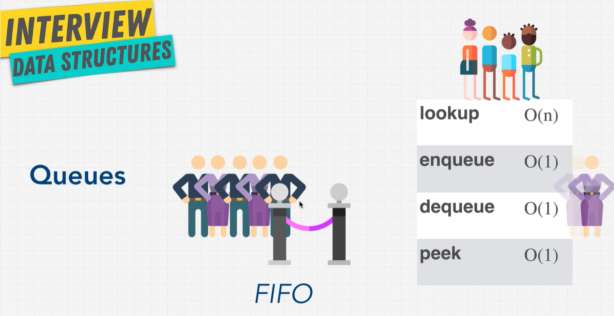

# Stacks & Queues

## Stacks


Stacks is a data structure. Like... A Stack of plates. You can only access the top plate of the stack.

> LIFO - Last In First Out.

| Method | Big O |
| ------ | ----- |
| lookup | O(n)  |
| pop    | O(1)  |
| push   | O(1)  |
| peek   | O(1)  |

When would we use stacks? Think of browser history, or undoing/redoing the last action you took (ever thought of ctrl + z?)

```js
// stacks - can be implemented using arrays or linked lists

// browser history

myspace - current site
facebook
twitter
google
// bottom of stack

/* to go back, you'll need to pop() off the current data myspace and save it temporarily if you want to go forward again to that site */
/* */
```

## Queues



Similar to stacks, but implements FIFO. Whoever lines up first, gets served first. Ever waited in line to get inside a store during the pandemic? Well, this is it.

> FIFO - First In First Out

| Method  | Big O |
| ------- | ----- |
| lookup  | O(n)  |
| enqueue | O(1)  |
| dequeue | O(1)  |
| peek    | O(1)  |

Both queues and stacks can be implemented using arrays, but implementing a queue using an array can be really inefficient due to shifting of the indexes (which is a O(n) operation)

```js
// queues - can be implemented using arrays or linked lists

// grocery checkout

Mary < -Joe < -Bob; //(end of line)

// LinkedList implementation would be better since you can remove/insert at head or remove/insert at tail.
// LinkedLists don't need resizing, and can avoid shifting the indexes if using array
```

## Pros and Cons of Stacks & Queues

| Pros            | Cons        |
| --------------- | ----------- |
| Fast Operations | Slow lookup |
| Fast Peek       |             |
| Ordered         |             |
