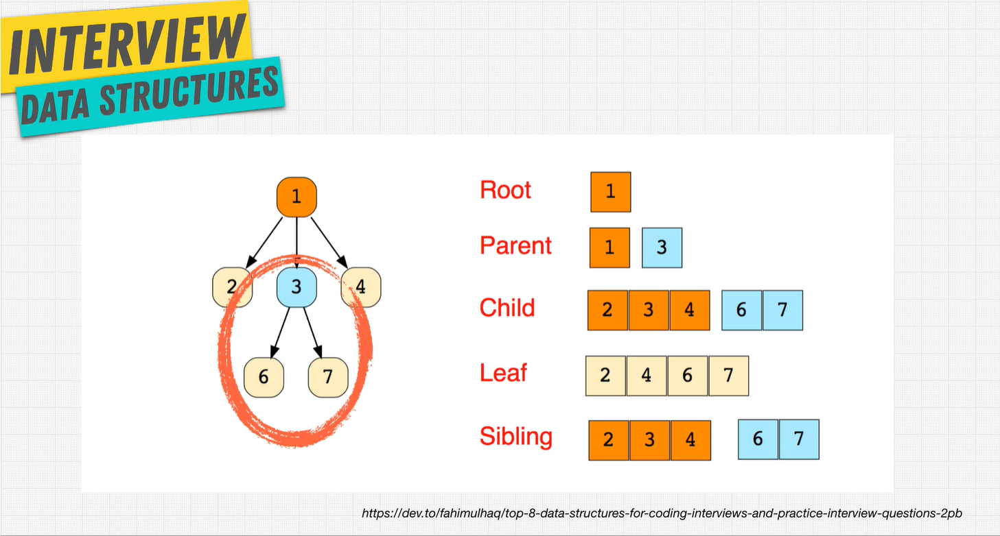
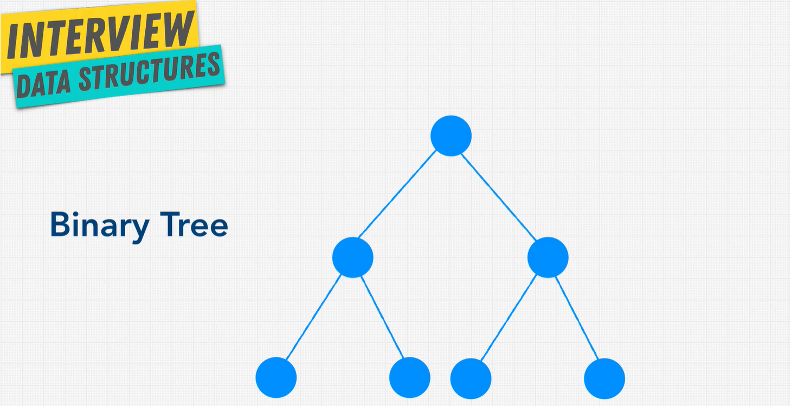
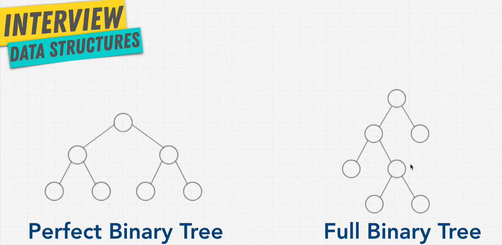
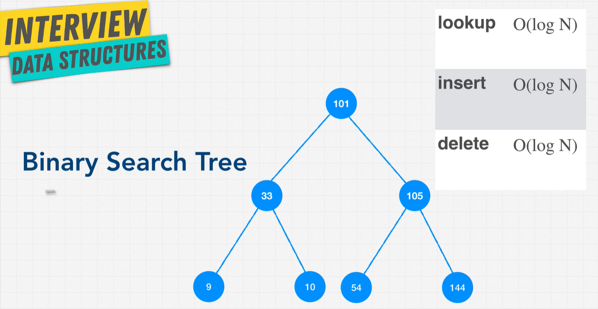
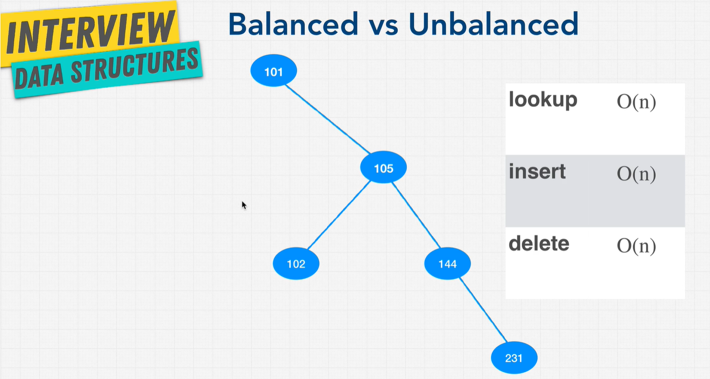

# Trees

A tree has a root node and child nodes (leaves). Examples of tree data structure can be found on the web (HTML Document), family tree, comment system, etc.

A node can only point down to a child.

## Binary Tree

Each node can either have, 0, 1 or 2 nodes. Each child can only have 1 parent.

| method | Big O    |
| ------ | -------- |
| lookup | O(log N) |
| insert | O(log N) |
| delete | O(log N) |

### O(log n)

- Level 0: 2^0 = 1 node
- Level 1: 2^1 = 2 nodes
- Level 2: 2^2 = 4 nodes
- Level 3: 2^3 = 8 nodes

\# of nodes = 2^h-1
log nodes = height

## Binary Search Trees

This preserves relationships. Think of parent folder, subfolder, subfolders, etc. BST's have 3 rules:

- All child nodes to the right of the node are higher than the parent.
- All child nodes to the left are less than the parent.
- A node can only have up to two children.

### Pros and Cons of BSTs

| Pros             | Cons               |
| ---------------- | ------------------ |
| Better than O(n) | No O(1) operations |
| Ordered          | ----               |
| Flexible Size    | ----               |

## Balanced vs Unbalanced BST

Unbalanced trees can resemble a lot like a linked list. This is problematic as many of the operations will become O(n) instead of O(log N). When the nodes aren't properly balanced on a tree, all the operations become O(n) because it will have to traverse through each node in the list. A balanced tree is O(log N) because it will only take half the number of operations as its discarding half of the tree every single time.
