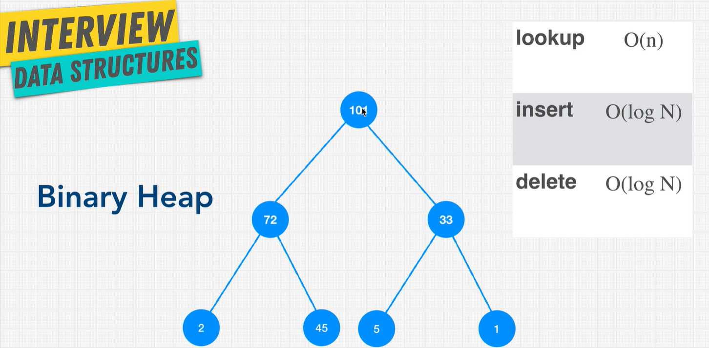
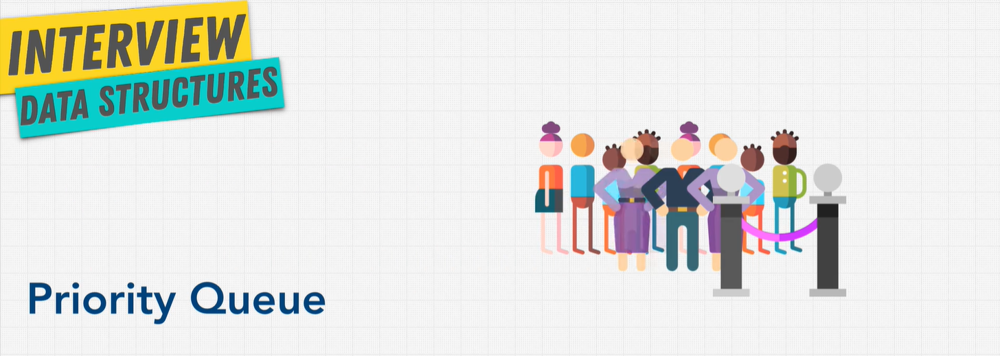
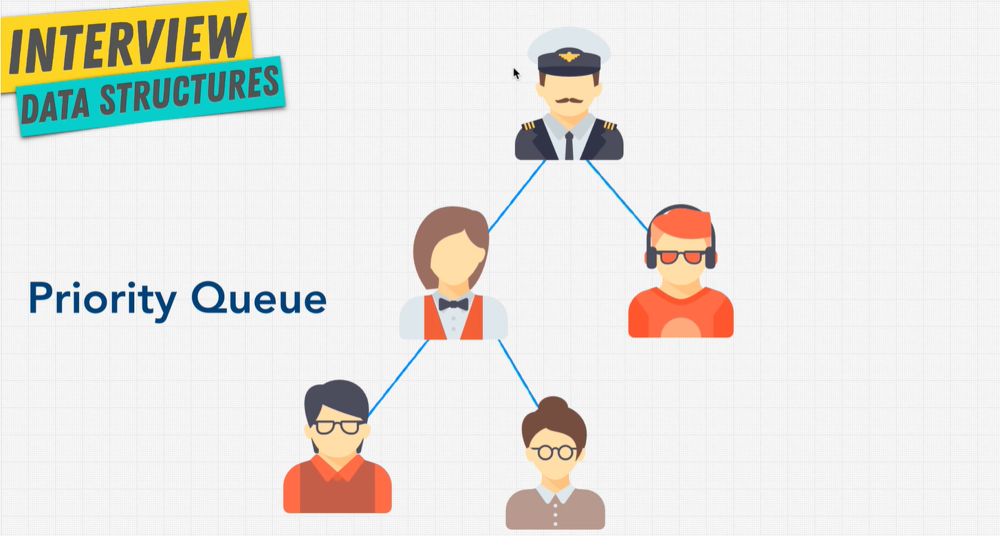
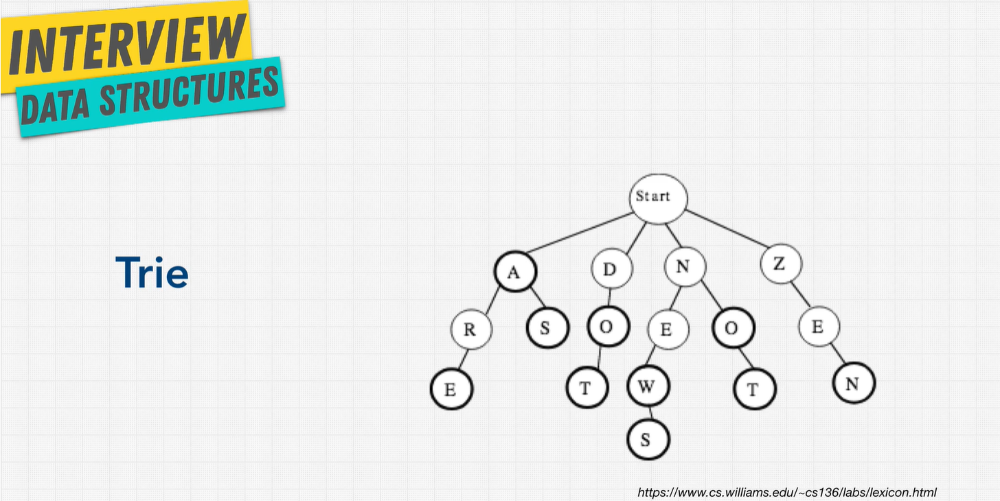

# Trees

A tree has a root node and child nodes (leaves). Examples of tree data structure can be found on the web (HTML Document), family tree, comment system, etc.

A node can only point down to a child.

## Binary Tree

Each node can either have, 0, 1 or 2 nodes. Each child can only have 1 parent.

| method | Big O    |
| ------ | -------- |
| lookup | O(log N) |
| insert | O(log N) |
| delete | O(log N) |

### O(log n)

- Level 0: 2^0 = 1 node
- Level 1: 2^1 = 2 nodes
- Level 2: 2^2 = 4 nodes
- Level 3: 2^3 = 8 nodes

\# of nodes = 2^h-1
log nodes = height

## Binary Search Trees

This preserves relationships. Think of parent folder, subfolder, subfolders, etc. BST's have 3 rules:

- All child nodes to the right of the node are higher than the parent.
- All child nodes to the left are less than the parent.
- A node can only have up to two children.

### Pros and Cons of BSTs

| Pros             | Cons               |
| ---------------- | ------------------ |
| Better than O(n) | No O(1) operations |
| Ordered          | ----               |
| Flexible Size    | ----               |

## Balanced vs Unbalanced BST

Unbalanced trees can resemble a lot like a linked list. This is problematic as many of the operations will become O(n) instead of O(log N). When the nodes aren't properly balanced on a tree, all the operations become O(n) because it will have to traverse through each node in the list. A balanced tree is O(log N) because it will only take half the number of operations as its discarding half of the tree every single time.

## How do you balance a tree?

- Red/black tree
  - [Red/Black Tree Animation](https://www.cs.usfca.edu/~galles/visualization/RedBlack.html)
  - [How Red/Black Trees Work](https://medium.com/basecs/painting-nodes-black-with-red-black-trees-60eacb2be9a5)
- AVL tree
  - [AVL Tree Animation](https://www.cs.usfca.edu/~galles/visualization/AVLtree.html)
  - [How AVL Trees Work](https://medium.com/basecs/the-little-avl-tree-that-could-86a3cae410c7)
- [Stack overflow: AVL Tree vs Red/Black Tree](https://stackoverflow.com/questions/13852870/red-black-tree-over-avl-tree)

## Binary Heaps

\* Mostly referring to Binary Heaps. Binary Heaps are really great at comparative operations. Used in data storage, priority queues, sorting algorithms.

[Visualgo Binary Heap](https://visualgo.net/en/heap?slide=1)

**Memory Heap != Heap Data Structure**

## Priority Queue

Binary heaps take the least amount of space possible. They do left to right insertion, no need to reorder. They can be implemented using arrays.

With priority queues, data that have higher value will be served first. Think of an amusement park with fast-lane entrance (higher priority).

The people in purple get to go ahead first.

People boarding the airplane. The captain has a higher priority than the passengers, the stewardess has a higher priority than the passengers, but not higher than the captain.

### Pros and Cons of Binary Heaps

| Pros             | Cons        |
| ---------------- | ----------- |
| Better than O(n) | Slow lookup |
| Priority         | ----        |
| Flexible Size    | ----        |
| Fast Insert      | ----        |

## Trie

A trie is a specialized tree used in searching, primarily used with text.  It can outperform binary trees, hashmaps, depending on the search you're doing.  A trie has an empty root node.

What is the runtime of a trie?  O(length of the word).  It looks at how long the word is.